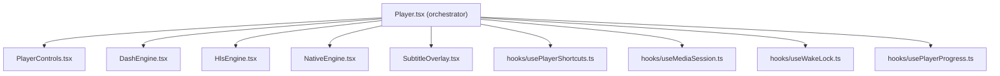

# InfinityPlay — Comprehensive Improvement Plan

## Overview

After a complete audit of **every source file** in the InfinityPlay codebase (main process, renderer, providers, CSS, configs, CI/CD), this plan organizes improvements into **7 pillars**, ordered by impact and urgency. Each section includes the exact files affected, what's wrong, and the proposed fix.

> [!NOTE]
> InfinityPlay is already a remarkably well-built application — strong typing, clean IPC architecture, excellent accessibility (skip-links, ARIA, D-pad navigation), and a robust cross-platform story (Electron + Capacitor Android). These recommendations build on that solid foundation.

---

## User Review Required

> [!IMPORTANT]
> **Scope decision needed**: This plan contains ~30 distinct improvements ranging from quick fixes to multi-day refactors. Please indicate which pillars/items to prioritize, or approve the full plan for phased execution.

> [!WARNING]
> **Pillar 1 (Security)** items should be addressed before any public release. The `ipmedia://` protocol path traversal risk and the store data-loss bug are the most critical findings.

## Open Questions

> [!IMPORTANT]
> 1. **iOS support** — Is iOS deployment planned? The Capacitor config has no iOS settings. This affects how much we invest in the Capacitor layer.
> 2. **Test framework preference** — There's no test suite. Do you prefer Vitest, Jest, or Playwright for the first tests?
> 3. **CSS strategy** — The 76KB monolithic CSS could be split into CSS Modules, or kept as a single file with better organization. Which do you prefer?
> 4. **Feature priority** — Are any of the new feature proposals (Pillar 7) higher priority than the architecture/quality improvements?

---

## Pillar 1 — Security & Data Integrity 🔴

Critical fixes that prevent data loss or exposure.

---

### 1.1 `ipmedia://` Protocol — Path Traversal Risk

**File**: [`index.ts`](file:///home/scorpiontaj/Desktop/Coding/InfinityPlay/src/main/index.ts)

**Problem**: The custom `ipmedia://` protocol reads files from disk based on a URL parameter. While only the app renderer calls it, a compromised or injected script could request `../../etc/passwd` or similar paths. There's no path canonicalization or allowlist check.

**Fix**: Validate that the resolved absolute path falls within the app's known download directories before serving.

```diff
+ import { normalize, resolve } from 'node:path'
+
+ function isSafePath(requestedPath: string, allowedDirs: string[]): boolean {
+   const resolved = resolve(normalize(requestedPath))
+   return allowedDirs.some(dir => resolved.startsWith(dir + '/') || resolved.startsWith(dir + '\\'))
+ }

  // In the ipmedia:// handler:
+ const downloadDir = app.getPath('downloads')
+ if (!isSafePath(filePath, [downloadDir, app.getPath('userData')])) {
+   return new Response('Forbidden', { status: 403 })
+ }
```

---

### 1.2 `JsonFile.read()` — Silent Data Wipe

**File**: [`store.ts`](file:///home/scorpiontaj/Desktop/Coding/InfinityPlay/src/main/store.ts)

**Problem**: `JsonFile.read()` catches **all** errors (including `EBUSY`, `EPERM`, transient antivirus locks) and silently replaces the in-memory cache with the default configuration. On the next `.write()`, the user's real data (favorites, history, settings) gets overwritten with defaults.

**Fix**: Only treat `ENOENT` (file doesn't exist) as "use defaults". Re-throw or log all other errors.

```diff
  } catch (err: unknown) {
-   this.cache = structuredClone(this.defaultValue)
+   if ((err as NodeJS.ErrnoException).code === 'ENOENT') {
+     this.cache = structuredClone(this.defaultValue)
+   } else {
+     console.error(`[store] Failed to read ${this.path}:`, err)
+     // Keep existing cache if available, otherwise use defaults
+     if (!this.cache) this.cache = structuredClone(this.defaultValue)
+   }
  }
```

---

### 1.3 CSP `unsafe-inline` Hardening

**File**: [`index.html`](file:///home/scorpiontaj/Desktop/Coding/InfinityPlay/src/renderer/index.html)

**Problem**: The Content-Security-Policy uses `'unsafe-inline'` for styles. While typical for Vite dev mode, production Electron builds should use nonces or hashes.

**Fix**: Use Vite's CSP nonce injection for production builds, keeping `unsafe-inline` only in development.

---

## Pillar 2 — Architecture & Modularity 🟠

Refactoring monolithic files into maintainable, testable modules.

---

### 2.1 Split `Player.tsx` (~2000 lines, 78KB)

**File**: [`Player.tsx`](file:///home/scorpiontaj/Desktop/Coding/InfinityPlay/src/renderer/src/components/Player.tsx)

**Problem**: This single file handles Web playback, DASH (dashjs), HLS (hls.js), Android native player, subtitle parsing/rendering, keyboard shortcuts, media session, wake locks, PiP, and the entire player UI chrome. It's the single largest file in the project and nearly impossible to review or modify safely.

**Proposed split**:



| New File | Responsibility | Est. Lines |
|---|---|---|
| `PlayerControls.tsx` | Play/pause, seek bar, volume, fullscreen, settings menu | ~400 |
| `DashEngine.tsx` | dashjs initialization, quality switching, error recovery | ~200 |
| `HlsEngine.tsx` | hls.js initialization, level switching | ~150 |
| `NativeEngine.tsx` | Capacitor Media3 bridge | ~150 |
| `SubtitleOverlay.tsx` | VTT parsing, styled subtitle rendering | ~200 |
| `usePlayerShortcuts.ts` | Keyboard/D-pad bindings | ~100 |
| `useMediaSession.ts` | MediaSession API integration | ~80 |
| `useWakeLock.ts` | Screen wake lock management | ~50 |
| `usePlayerProgress.ts` | Progress tracking, resume position | ~80 |

---

### 2.2 Split `DetailsPage.tsx` (~650 lines)

**File**: [`DetailsPage.tsx`](file:///home/scorpiontaj/Desktop/Coding/InfinityPlay/src/renderer/src/pages/DetailsPage.tsx)

**Proposed extraction**:
- `EpisodePicker.tsx` — Season/episode selection grid
- `AudioTrackSelector.tsx` — Audio language/dub selection
- `SourceList.tsx` — Stream quality/source display
- `DownloadActions.tsx` — Download button logic and season batch UI

---

### 2.3 Split `SettingsPage.tsx` (~620 lines)

**File**: [`SettingsPage.tsx`](file:///home/scorpiontaj/Desktop/Coding/InfinityPlay/src/renderer/src/pages/SettingsPage.tsx)

**Proposed extraction**:
- `AppearanceSettings.tsx` — Theme, accent, layout preferences
- `PlaybackSettings.tsx` — Autoplay, quality defaults, hardware acceleration
- `SubtitleSettings.tsx` — Font, size, color, position
- `IptvSettings.tsx` — M3U URL, XMLTV, Xtream credentials
- `ApiSettings.tsx` — TMDB token, region settings

---

### 2.4 Split `ipc.ts` by Domain

**File**: [`ipc.ts`](file:///home/scorpiontaj/Desktop/Coding/InfinityPlay/src/main/ipc.ts)

**Problem**: Single 250+ line file handling all IPC across catalog, downloads, updates, settings, streams, live TV, and subtitles.

**Proposed split**:
```
src/main/ipc/
  index.ts          — registers all domain handlers
  catalog.ts        — search, details, home, person, releases
  downloads.ts      — download start/cancel/pause/resume/remove
  live.ts           — probe, prepare, prune, IPTV channels
  settings.ts       — config read/write, favorites, history
  updates.ts        — check/download/install updates
```

---

### 2.5 Split Zustand Store into Slices

**File**: [`store.ts`](file:///home/scorpiontaj/Desktop/Coding/InfinityPlay/src/renderer/src/store.ts)

**Problem**: Single "god object" store (~460 lines) containing routes, config, downloads, player state, favorites, history, and toasts. Any state update (like a download progress tick) triggers re-evaluation in every component that subscribes via `useApp`.

**Fix**: Split into domain slices using Zustand's slice pattern:

```typescript
// store/playerSlice.ts
export const createPlayerSlice = (set, get) => ({
  playerState: null,
  setPlayerState: (s) => set({ playerState: s }),
  // ...
})

// store/configSlice.ts
export const createConfigSlice = (set, get) => ({
  config: defaultConfig,
  setConfig: (c) => set({ config: c }),
  // ...
})

// store/index.ts — combines all slices
export const useApp = create((...a) => ({
  ...createPlayerSlice(...a),
  ...createConfigSlice(...a),
  ...createDownloadSlice(...a),
  ...createRouteSlice(...a),
}))
```

---

### 2.6 Modularize `styles.css` (76KB, ~3200 lines)

**File**: [`styles.css`](file:///home/scorpiontaj/Desktop/Coding/InfinityPlay/src/renderer/src/styles.css)

**Problem**: Single monolithic CSS file with global class names. Risk of naming collisions and impossible to code-split.

**Option A — CSS file splitting** (minimal refactor):
```
styles/
  tokens.css        — CSS variables, themes, typography
  layout.css        — sidebar, topbar, page shell
  components.css    — cards, buttons, inputs, badges
  player.css        — player chrome, controls, subtitles
  pages.css         — page-specific overrides
  responsive.css    — media queries, device adaptations
  animations.css    — keyframes, transitions
```

**Option B — CSS Modules** (larger refactor, better isolation):
Each component gets a co-located `.module.css` file.

---

### 2.7 Fix `tsconfig.web.json` Misconfiguration

**File**: [`tsconfig.web.json`](file:///home/scorpiontaj/Desktop/Coding/InfinityPlay/src/renderer/../../tsconfig.web.json)

**Problem**: Includes `src/main/providers/**/*` and `src/main/streams.ts` in the web/renderer compilation context. This is an architectural boundary violation — Node/Main process code should never be type-checked as part of the renderer.

```diff
  "include": [
    "src/renderer/src/**/*",
    "src/shared/**/*",
-   "src/main/providers/**/*",
-   "src/main/streams.ts",
    "src/preload/index.d.ts"
  ]
```

---

## Pillar 3 — Performance 🟡

Optimizations for smoother UI and lower resource usage.

---

### 3.1 Memoize Heavy List Components

**Files**: [`PosterCard.tsx`](file:///home/scorpiontaj/Desktop/Coding/InfinityPlay/src/renderer/src/components/PosterCard.tsx), [`Row.tsx`](file:///home/scorpiontaj/Desktop/Coding/InfinityPlay/src/renderer/src/components/Row.tsx)

**Problem**: `PosterCard` subscribes to the global `useApp` store for favorite tracking. When *any* store state changes (download progress, route, etc.), every visible poster card re-renders.

**Fix**:
```diff
- export function PosterCard({ item }: Props) {
+ export const PosterCard = React.memo(function PosterCard({ item }: Props) {
    // ...
- }
+ })
```

Also use Zustand selectors to subscribe to only the needed slice:
```typescript
const isFavorite = useApp(s => s.favorites.some(f => f.id === item.id))
```

---

### 3.2 Fix Unbounded Caches in Live Transcoding

**File**: [`live.ts`](file:///home/scorpiontaj/Desktop/Coding/InfinityPlay/src/main/live.ts)

**Problem**: `prepared` and `probeCache` maps grow without bound during long app sessions. Each entry may hold references to spawned processes or large probe data.

**Fix**: Implement a TTL-based eviction or maximum size limit:
```typescript
const MAX_CACHE_SIZE = 50
function evictOldest(map: Map<string, unknown>) {
  if (map.size > MAX_CACHE_SIZE) {
    const oldest = map.keys().next().value
    if (oldest) map.delete(oldest)
  }
}
```

---

### 3.3 Replace `spawnSync` in `toolAvailable`

**File**: [`media-tools.ts`](file:///home/scorpiontaj/Desktop/Coding/InfinityPlay/src/main/media-tools.ts)

**Problem**: `toolAvailable()` uses `spawnSync` which blocks the Electron main thread. If `ffmpeg` or `ffprobe` is slow to respond, the entire app UI freezes.

**Fix**: Convert to async `spawn` with a short timeout, cache the result.

---

### 3.4 Replace PowerShell Process Suspension

**File**: [`process-control.ts`](file:///home/scorpiontaj/Desktop/Coding/InfinityPlay/src/main/process-control.ts)

**Problem**: On Windows, pausing/resuming ffmpeg downloads spawns a full PowerShell instance executing inline C# P/Invoke code to call `NtSuspendProcess`. This is slow (~200ms+), resource-heavy, and can be blocked by execution policies.

**Fix options**:
1. Use a tiny native Node addon (e.g., `ntsuspend` npm package)
2. Use `SIGSTOP`/`SIGCONT` on Linux/macOS (already works) and accept Windows limitations
3. Re-architect downloads to use cancellation tokens instead of process suspension

---

## Pillar 4 — Reliability & Error Handling 🟡

Making the app more resilient to edge cases.

---

### 4.1 Add FFmpeg Stall Timeout

**File**: [`downloads.ts`](file:///home/scorpiontaj/Desktop/Coding/InfinityPlay/src/main/downloads.ts)

**Problem**: When ffmpeg is remuxing DASH adaptive streams, if the network drops but the process doesn't exit, the download hangs indefinitely with no user feedback.

**Fix**: Monitor stdout/stderr activity. If no output for 60 seconds, kill the process and report a timeout error to the renderer.

```typescript
let lastActivity = Date.now()
proc.stderr.on('data', () => { lastActivity = Date.now() })

const stall = setInterval(() => {
  if (Date.now() - lastActivity > 60_000) {
    proc.kill('SIGKILL')
    clearInterval(stall)
    reject(new Error('Download stalled — no progress for 60 seconds'))
  }
}, 10_000)
```

---

### 4.2 Improve Regex-Based Parsing Resilience

**Files**: [`epg.ts`](file:///home/scorpiontaj/Desktop/Coding/InfinityPlay/src/main/providers/epg.ts), [`adapt.ts`](file:///home/scorpiontaj/Desktop/Coding/InfinityPlay/src/main/providers/moviebox/adapt.ts)

**Problem**:
- `epg.ts` parses 30MB+ XMLTV files using regex instead of a streaming XML parser. Malformed XML silently produces wrong data.
- `adapt.ts` uses regex to parse dub titles which can break on unexpected naming patterns.

**Fix**:
- For EPG: Use a lightweight streaming SAX parser (e.g., `sax-js`) or at minimum add validation checks.
- For adapt: Add fallback logic when regex doesn't match, and unit tests for edge cases.

---

### 4.3 Add React Error Boundaries

**File**: [`App.tsx`](file:///home/scorpiontaj/Desktop/Coding/InfinityPlay/src/renderer/src/App.tsx)

**Problem**: No error boundaries exist. A rendering crash in any component (e.g., bad API data causing a `.map()` on `undefined`) crashes the entire app.

**Fix**: Add error boundaries around major page sections:
```tsx
<ErrorBoundary fallback={<CrashRecovery />}>
  {currentPage}
</ErrorBoundary>
```

---

## Pillar 5 — Developer Experience 🔵

Improvements that accelerate future development.

---

### 5.1 Add a Test Suite

**Current state**: Zero tests. `typecheck` is the only validation gate.

**Proposed first tests**:

| Layer | Framework | What to test |
|---|---|---|
| Main process | Vitest | `store.ts` (atomic writes, error handling), `crypto.ts` (signature generation), `adapt.ts` (response mapping), `m3u.ts` (playlist parsing) |
| Renderer | Vitest + Testing Library | `useAsync` hook, `store.ts` slice selectors, `format.ts` utilities |
| E2E | Playwright + Electron | App launch, navigation, search, playback initiation |

---

### 5.2 Add ESLint / Biome

**Current state**: No linter configured. Style consistency relies on convention.

**Recommendation**: Add Biome (fast, zero-config) for linting and formatting:
```bash
npx @biomejs/biome init
```

---

### 5.3 Improve Developer Documentation

- Add JSDoc to the most complex modules: `moviebox/crypto.ts`, `moviebox/client.ts`, `live.ts`
- Document the IPC contract with a shared type map
- Add architecture diagrams to the README

---

## Pillar 6 — UX & Accessibility Enhancements 🔵

Polish the user experience.

---

### 6.1 Keyboard Shortcut Help Overlay

**Problem**: The player has extensive keyboard shortcuts (Space, K, M, F, Arrow keys, numbers, brackets) but no discoverability mechanism.

**Fix**: Add a `?` key binding that shows a translucent overlay listing all shortcuts, similar to YouTube's `?` shortcut.

---

### 6.2 Network Status Indicator

**Problem**: When the network drops, API calls fail silently or show generic error states.

**Fix**: Add `navigator.onLine` monitoring with a toast notification when connectivity is lost/restored.

---

### 6.3 "Continue Watching" Row on Home Page

**Files**: [`HomePage.tsx`](file:///home/scorpiontaj/Desktop/Coding/InfinityPlay/src/renderer/src/pages/HomePage.tsx), [`store.ts`](file:///home/scorpiontaj/Desktop/Coding/InfinityPlay/src/renderer/src/store.ts)

**Current state**: Watch history exists but isn't surfaced on the home page.

**Fix**: Add a "Continue Watching" row at the top of the home page, showing items with incomplete progress (e.g., watched < 90%), with a progress bar on each card.

---

### 6.4 Improved Empty States

**Problem**: Some pages (Favorites, History) show basic empty states.

**Fix**: Add contextual illustrations and actionable CTAs (e.g., "Browse trending movies" button on empty favorites).

---

### 6.5 Toast System Improvements

**Current state**: Basic toast notifications exist.

**Improvements**:
- Add undo actions for destructive operations (remove from favorites, cancel download)
- Add progress toasts for long operations (season downloads)
- Stack multiple toasts with proper animation

---

## Pillar 7 — New Features 🟢

Higher-effort features that add significant value.

---

### 7.1 Watch Party / Shared Viewing (Future)

Allow synchronized playback with friends via WebRTC or a lightweight signaling server. This is a major feature — flag it for future consideration.

---

### 7.2 Smart Recommendations

**Current state**: Home page shows catalog-provided rows.

**Enhancement**: Use local watch history to build a simple "Because you watched X" recommendation row using genre/tag matching — all client-side, no external service needed.

---

### 7.3 Parental Controls

**Current state**: Adult content is filtered in `adapt.ts` using hardcoded studio/keyword lists.

**Enhancement**: Add a PIN-protected parental control setting that controls content maturity filtering levels.

---

### 7.4 Import/Export User Data

**Enhancement**: Add settings options to export (JSON backup) and import favorites, watch history, and configuration. Protects against data loss and enables migration between devices.

---

### 7.5 ARM64 Build Targets

**File**: [`electron-builder.yml`](file:///home/scorpiontaj/Desktop/Coding/InfinityPlay/electron-builder.yml)

**Current state**: Windows and Linux only target `x64`. macOS targets both `x64` and `arm64`.

**Fix**: Add `arm64` to Windows and Linux targets to support modern ARM hardware (Snapdragon laptops, Raspberry Pi, etc.):
```diff
  win:
-   target: [{ target: nsis, arch: [x64] }]
+   target: [{ target: nsis, arch: [x64, arm64] }]
  linux:
-   target: [{ target: AppImage, arch: [x64] }, ...]
+   target: [{ target: AppImage, arch: [x64, arm64] }, ...]
```

---

## Verification Plan

### Automated Tests
```bash
# Type checking (existing)
npm run typecheck

# Unit tests (after Pillar 5.1)
npx vitest run

# Build verification
npm run build
```

### Manual Verification
After each pillar:
1. Launch with `npm run dev` and verify no regressions in navigation, playback, and downloads
2. Test on Android via `npm run cap:sync && cap open android`
3. Verify keyboard/D-pad navigation still works across all pages
4. Check that favorites, history, and settings persist across app restarts
5. Test the player with DASH, HLS, and direct file sources

---

## Execution Priority

| Priority | Pillar | Effort | Impact |
|---|---|---|---|
| 🔴 P0 | 1 — Security & Data Integrity | 1-2 days | Critical |
| 🟠 P1 | 2.7 — Fix tsconfig misconfiguration | 10 min | Quick win |
| 🟠 P1 | 3.1 — Memoize list components | 1 hour | Quick win |
| 🟠 P1 | 4.3 — Error boundaries | 2 hours | Quick win |
| 🟡 P2 | 2.1 — Split Player.tsx | 2-3 days | High |
| 🟡 P2 | 2.5 — Split Zustand store | 1 day | High |
| 🟡 P2 | 4.1 — FFmpeg stall timeout | 2 hours | Medium |
| 🔵 P3 | 2.2, 2.3, 2.4 — Split pages & IPC | 2-3 days | Medium |
| 🔵 P3 | 2.6 — Modularize CSS | 1-2 days | Medium |
| 🔵 P3 | 5.1 — Test suite | 2-3 days | High (long-term) |
| 🔵 P3 | 6.1-6.5 — UX enhancements | 2-3 days | Medium |
| 🟢 P4 | 7.x — New features | Varies | Nice-to-have |
